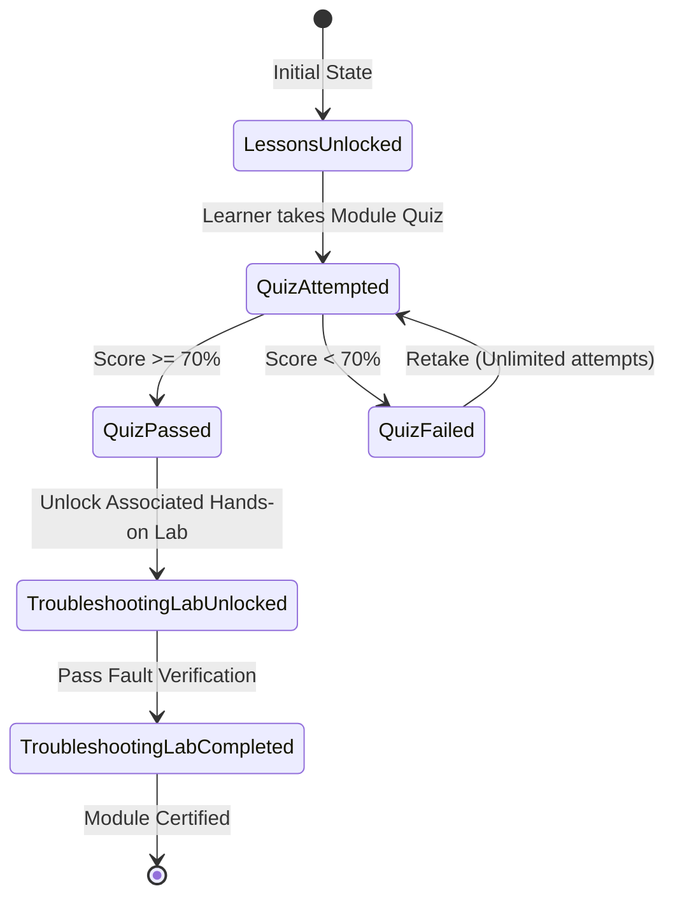
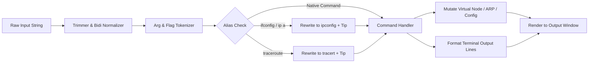

# Data Model & State Specifications: Shabk

**Feature**: Shabk — Persian Interactive Network+ Learning Platform  
**Branch**: `001-shabk-network-course`  
**Date**: 2026-09-15  

---

## 1. Entity Definitions & Schemas

### 1.1 Curriculum & Instructional Content

#### `CourseModule` (فصل آموزشی)
Represents one of the 8 major CompTIA Network+ curriculum areas derived from the 124-page course booklet.

| Field | Type | Description | Validation / Constraints |
| :--- | :--- | :--- | :--- |
| `id` | `string` | Unique identifier (e.g., `'module-1'`) | Matches regex `^module-[1-8]$` |
| `order` | `number` | Display and progression sequence (1 to 8) | Integer, $1 \le order \le 8$, unique |
| `titleFa` | `string` | Persian module title | Non-empty Persian text |
| `titleEn` | `string` | English official curriculum title | e.g. `'Network Fundamentals & Reference Models'` |
| `descriptionFa` | `string` | High-yield summary of module objectives | Persian prose |
| `estimatedMinutes` | `number` | Estimated study duration in minutes | Integer $> 0$ |
| `icon` | `string` | Icon key mapping to Lucide icon | Valid Lucide icon identifier |
| `lessonIds` | `string[]` | Ordered list of constituent lesson IDs | Array of existing `Lesson.id` |
| `labIds` | `string[]` | Associated hands-on troubleshooting labs | Array of existing `TroubleshootingLab.id` |
| `quizId` | `string` | Associated end-of-module assessment ID | References `Quiz.id` |

#### `Lesson` (درس / مبحث آموزشی)
Represents a focused topic within a module.

| Field | Type | Description | Validation / Constraints |
| :--- | :--- | :--- | :--- |
| `id` | `string` | Unique identifier (e.g., `'lesson-1-2'`) | String identifier |
| `moduleId` | `string` | Parent module reference | References `CourseModule.id` |
| `order` | `number` | Sequential position within parent module | Integer $\ge 1$ |
| `titleFa` | `string` | Persian lesson title | e.g. `'مدل ۷ لایه‌ای OSI در برابر مدل DoD'` |
| `titleEn` | `string` | English technical topic | e.g. `'OSI 7-Layer vs DoD Model'` |
| `contentMarkdownFa` | `string` | Formatted Persian instructional markdown | Valid Markdown with LTR code fences |
| `keyTakeawaysFa` | `string[]` | High-yield summary bullets for quick review | 2–5 summary bullets |
| `visualizerType` | `string` | Embedded interactive widget type | `'osi-stack' \| 'packet-flow' \| 'cam-table' \| 'tcp-handshake' \| 'bit-flipper' \| 'cable-wiring' \| 'none'` |

---

### 1.2 Network Simulation Domain Model

#### `VirtualNetworkNode` (گره شبکه مجازی)
Represents a host, switch, router, or server within the in-memory network topology.

| Field | Type | Description | Validation / Constraints |
| :--- | :--- | :--- | :--- |
| `id` | `string` | Unique node identifier (e.g., `'host-a'`) | Unique within scenario |
| `name` | `string` | Friendly display label (e.g., `'PC-A'`) | Non-empty string |
| `type` | `string` | Hardware role | `'host' \| 'switch' \| 'router' \| 'server'` |
| `interfaces` | `VirtualInterface[]` | Network interfaces attached to node | At least 1 for hosts/servers, $\ge 2$ for routers/switches |
| `arpTable` | `Record<string, ArpEntry>` | IP-to-MAC address mapping cache | Key is valid IPv4 string |
| `routingTable` | `RouteEntry[]` | Layer 3 routing rules | Required for routers/hosts |
| `dnsConfig` | `DnsConfig` | Primary/secondary DNS resolver IPs | e.g., `primary: '8.8.8.8'` |

#### `VirtualInterface` (رابط شبکه مجازی)
Represents an individual physical or logical network adapter.

| Field | Type | Description | Validation / Constraints |
| :--- | :--- | :--- | :--- |
| `name` | `string` | Interface name (e.g., `'eth0'`, `'FastEthernet0/1'`) | Unique per node |
| `macAddress` | `string` | 48-bit physical hardware address | Regex `^([0-9A-Fa-f]{2}[:-]){5}([0-9A-Fa-f]{2})$` |
| `ipAddress` | `string` | Configured IPv4 address | Valid IPv4 format (`0.0.0.0` if unassigned) |
| `subnetMask` | `string` | Dotted-decimal subnet mask | Valid IPv4 mask (e.g., `'255.255.255.0'`) |
| `cidr` | `number` | Prefix length corresponding to subnet mask | Integer, $0 \le cidr \le 32$ |
| `defaultGateway` | `string` | Next-hop router IP for non-local traffic | Valid IPv4 format |
| `status` | `'up' \| 'down'` | Link carrier status | Default `'up'` |

#### `ArpEntry` (رکورد جدول ARP)
| Field | Type | Description | Validation / Constraints |
| :--- | :--- | :--- | :--- |
| `ipAddress` | `string` | Resolved IPv4 address | Dotted decimal |
| `macAddress` | `string` | Associated hardware MAC address | Standard MAC format |
| `type` | `'dynamic' \| 'static'` | Allocation type | Defaults to `'dynamic'` |
| `updatedAt` | `number` | Timestamp of resolution | Unix timestamp in ms |

---

### 1.3 Subnetting Engine Data Types

#### `SubnetCalculation` (محاسبات زیرشبکه)
Calculated output produced by the pure TypeScript IPv4 math library.

| Field | Type | Description | Example |
| :--- | :--- | :--- | :--- |
| `inputIp` | `string` | Original input address | `'192.168.10.45'` |
| `cidr` | `number` | Prefix notation length | `26` |
| `subnetMask` | `string` | Dotted-decimal subnet mask | `'255.255.255.192'` |
| `networkAddress` | `string` | Computed Network ID | `'192.168.10.0'` |
| `broadcastAddress` | `string` | Computed Directed Broadcast IP | `'192.168.10.63'` |
| `firstUsableIp` | `string` | First valid assignable host address | `'192.168.10.1'` |
| `lastUsableIp` | `string` | Last valid assignable host address | `'192.168.10.62'` |
| `totalHosts` | `number` | Total address space ($2^{32-cidr}$) | `64` |
| `usableHosts` | `number` | Assignable host count ($2^{32-cidr} - 2$) | `62` (RFC 3021 /31 yields 2) |
| `binaryIp` | `string` | 32-bit binary string (dot-separated) | `'11000000.10101000.00001010.00101101'` |
| `binaryMask` | `string` | 32-bit binary mask (dot-separated) | `'11111111.11111111.11111111.11000000'` |
| `ipClass` | `'A' \| 'B' \| 'C' \| 'D' \| 'E'` | Traditional IPv4 class | `'C'` |
| `isPrivate` | `boolean` | RFC 1918 Private range flag | `true` |

#### `SubnetDrill` (چالش ساب‌نتینگ)
| Field | Type | Description |
| :--- | :--- | :--- |
| `id` | `string` | Challenge identifier |
| `type` | `'network_id' \| 'broadcast' \| 'usable_range' \| 'host_count' \| 'cidr_to_mask'` | Drill category |
| `promptFa` | `string` | Persian question text |
| `givenIp` | `string` | Input IP address |
| `givenCidr` | `number` | Prefix length |
| `expectedAnswer` | `string` | Exact normalized expected string |
| `derivationStepsFa` | `string[]` | Step-by-step Persian mathematical explanation |

---

### 1.4 Assessment & Troubleshooting Lab Entities

#### `QuizQuestion` (سوال آزمون)
| Field | Type | Description | Validation / Constraints |
| :--- | :--- | :--- | :--- |
| `id` | `string` | Unique question identifier | e.g. `'q-1-1'` |
| `moduleId` | `string` | Module reference | References `CourseModule.id` |
| `questionFa` | `string` | Persian question text | Clear interrogative |
| `optionsFa` | `string[]` | Answer choices (2 to 4 options) | Non-empty strings |
| `correctIndex` | `number` | 0-indexed position of correct answer | $0 \le correctIndex < optionsFa.length$ |
| `explanationFa` | `string` | Detailed rationale explaining why the answer is correct | Persian educational prose |
| `category` | `'theory' \| 'calculation' \| 'troubleshooting'` | Cognitive domain | Used for diagnostic score breakdown |

#### `TroubleshootingLab` (آزمایشگاه عیب‌یابی)
| Field | Type | Description |
| :--- | :--- | :--- |
| `id` | `string` | Unique lab identifier (e.g., `'lab-gateway-outage'`) |
| `moduleId` | `string` | Parent module requirement |
| `titleFa` | `string` | Persian title (e.g., `'سناریوی قطعی گیت‌وی'`) |
| `scenarioBriefFa` | `string` | Real-world problem description and ticket background |
| `initialNodes` | `VirtualNetworkNode[]` | Initial state with injected network fault |
| `hintsFa` | `string[]` | Progressive diagnostic tips in Persian |
| `verification` | `LabVerificationRule` | Automated check condition verifying whether the fault is fixed |
| `takeawayFa` | `string` | Engineering lesson learned upon successful resolution |

---

### 1.5 Persistent Learner State (LocalStorage & Export)

#### `LearnerProgress` (کارنامه و سوابق یادگیرنده)
Root schema persisted in browser storage and exported as JSON.

```typescript
export interface LearnerProgress {
  schemaVersion: 1;
  lastUpdated: string; // ISO 8601 string
  completedLessonIds: string[];
  unlockedLabIds: string[];
  completedLabIds: string[];
  quizResults: Record<string, {
    bestScore: number;       // Percentage 0 - 100
    passed: boolean;         // >= 70%
    attempts: number;
    lastAttemptDate: string;
    mode: 'study' | 'exam';
  }>;
  drillStats: {
    totalAttempted: number;
    totalCorrect: number;
    currentStreak: number;
    bestStreak: number;
  };
  preferences: {
    theme: 'light' | 'dark';
    terminalFontSize: 'sm' | 'md' | 'lg';
  };
}
```

---

## 2. State Transitions & Lifecycle

### 2.1 Module Progression & Lab Unlocking State Machine



### 2.2 Terminal Command Execution Pipeline


