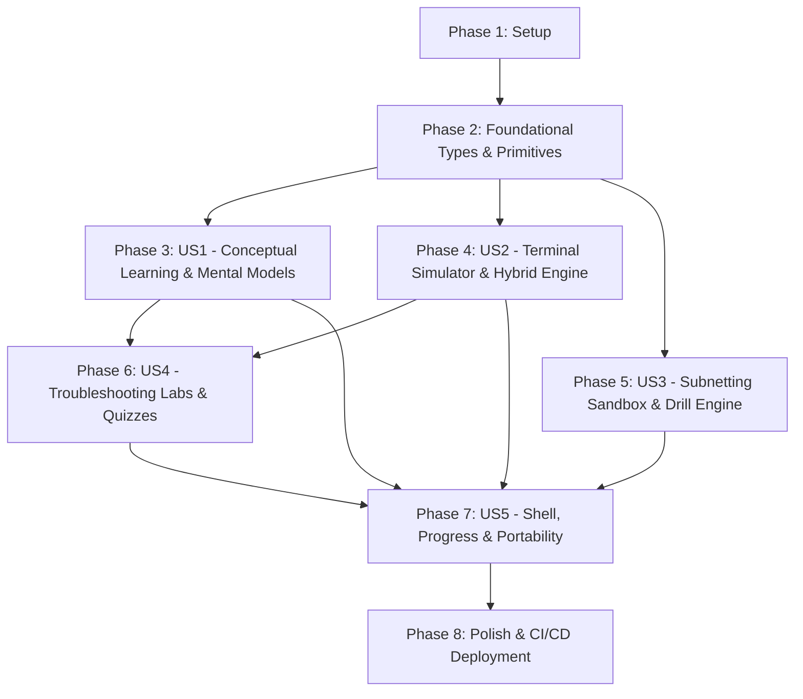

---

description: "Task list for Shabk: Persian Interactive Network+ Learning Platform"
---

# Tasks: Shabk — Persian Interactive Network+ Learning Platform

**Input**: Design documents from `/specs/001-shabk-network-course/`  
**Prerequisites**: `plan.md`, `spec.md`, `research.md`, `data-model.md`, `contracts/`, `quickstart.md`  
**Target Architecture**: Single-page static web app (React 19 + TypeScript + Vite + Tailwind CSS), 100% client-side, zero backend, deployable to GitHub Pages.

---

## Phase 1: Setup (Shared Infrastructure)

**Purpose**: Project initialization, toolchain configuration, and baseline directory structure.

- [X] T001 Scaffold Vite React 19 TypeScript project in repository root with `package.json`, `tsconfig.json`, and `vite.config.ts` configured for static base `./`
- [X] T002 Install and configure Tailwind CSS v3/v4 with `@tailwindcss/typography`, Vazirmatn font loading, and custom warm palette tokens in `tailwind.config.js` and `src/index.css`
- [X] T003 [P] Install core runtime dependencies (`lucide-react`, `canvas-confetti`) and dev dependencies (`vitest`, `@testing-library/react`, `jsdom`) in `package.json`
- [X] T004 [P] Configure Vitest test runner and DOM testing environment in `vitest.config.ts`
- [X] T005 [P] Create complete source folder tree per plan (`src/components/`, `src/data/`, `src/lib/`, `src/types/`, `src/assets/`, `tests/`)

---

## Phase 2: Foundational (Blocking Prerequisites)

**Purpose**: Core TypeScript data contracts, shared utilities, bidi isolation helpers, and persistent storage primitives that MUST exist before user stories can be assembled.

**⚠️ CRITICAL**: No user story work can begin until this foundational phase is complete.

- [X] T006 Create shared TypeScript domain types (`CourseModule`, `Lesson`, `QuizQuestion`, `TroubleshootingLab`) in `src/types/course.ts` matching `contracts/course-schema.json`
- [X] T007 [P] Create network simulation and interface types (`VirtualNetworkNode`, `VirtualInterface`, `ArpEntry`, `RouteEntry`, `DnsConfig`) in `src/types/network.ts` matching `data-model.md`
- [X] T008 [P] Create terminal I/O and command types (`TerminalCommand`, `TerminalOutput`, `OutputLine`) in `src/types/terminal.ts` matching `contracts/terminal-simulator.json`
- [X] T009 [P] Create subnetting calculation and drill types (`SubnetCalculation`, `SubnetDrill`) in `src/types/subnet.ts` matching `contracts/subnet-engine.json`
- [X] T010 [P] Create persistent learner state and backup types (`LearnerProgress`, `QuizScore`) in `src/types/progress.ts` matching `contracts/progress-export.json`
- [X] T011 [P] Implement bidirectional text isolation helper functions (`wrapLtr`, `formatIpAddress`, `formatMacAddress`) in `src/lib/utils/bidi.ts`
- [X] T012 Implement baseline client-side storage adapter with schema validation in `src/lib/storage/progress-store.ts`
- [X] T013 [P] Create atomic UI components (`Button`, `Card`, `Badge`, `Modal`, `Tooltip`, `Tabs`) in `src/components/ui/` with RTL styling and warm palette classes

**Checkpoint**: Core types, utility wrappers, UI primitives, and storage adapters ready. User story development can now proceed in parallel.

---

## Phase 3: User Story 1 - Interactive Conceptual Learning & Mental Model Exploration (Priority: P1) 🎯 MVP

**Goal**: Deliver the 8 comprehensive Persian Network+ learning modules derived from Mohandes Rajaei's 124-page booklet, paired with interactive visualizers (OSI Stack, Packet Encapsulation, Cable Crimping tool, and TCP Handshake).

**Independent Test**: Can be verified by browsing any module lesson in Persian, interacting with the OSI layer inspector and packet flow animator, and toggling sequential lesson navigation.

### Implementation for User Story 1

- [X] T014 [P] [US1] Author Persian curriculum content for Module 1 (*مبانی شبکه و مدل‌های مرجع*) in `src/data/modules/module-1-foundations.ts`
- [X] T015 [P] [US1] Author Persian curriculum content for Module 2 (*رسانه‌های انتقال، کابل‌کشی و توپولوژی‌ها*) in `src/data/modules/module-2-physical-media.ts`
- [X] T016 [P] [US1] Author Persian curriculum content for Module 3 (*لایه پیوند داده، مک‌آدرس و سوئیچینگ*) in `src/data/modules/module-3-datalink-switching.ts`
- [X] T017 [P] [US1] Author Persian curriculum content for Module 4 (*آدرس‌دهی شبکه IPv4 و زیرشبکه‌سازی*) in `src/data/modules/module-4-ipv4-subnetting.ts`
- [X] T018 [P] [US1] Author Persian curriculum content for Module 5 (*پروتکل‌های تفکیک آدرس و عیب‌یابی لایه ۳*) in `src/data/modules/module-5-resolution-diagnostics.ts`
- [X] T019 [P] [US1] Author Persian curriculum content for Module 6 (*لایه انتقال، پورت‌ها و سوکت‌ها*) in `src/data/modules/module-6-transport-ports.ts`
- [X] T020 [P] [US1] Author Persian curriculum content for Module 7 (*سرویس‌های بنیادین شبکه و لایه کاربرد*) in `src/data/modules/module-7-network-services.ts`
- [X] T021 [P] [US1] Author Persian curriculum content for Module 8 (*امنیت، فایروال و ترجمه آدرس شبکه*) in `src/data/modules/module-8-security-nat.ts`
- [X] T022 [US1] Implement central module index and metadata loader in `src/data/modules/index.ts`
- [X] T023 [P] [US1] Implement interactive OSI 7-layer vs. DoD 4-layer inspector widget in `src/components/visualizers/OsiStackInspector.tsx`
- [X] T024 [P] [US1] Implement step-by-step packet encapsulation & decapsulation animator (Host A -> Switch -> Router -> Host B) in `src/components/visualizers/PacketFlowAnimator.tsx`
- [X] T025 [P] [US1] Implement interactive T568A vs. T568B RJ45 color-wire crimping widget in `src/components/visualizers/CableWiringGame.tsx`
- [X] T026 [P] [US1] Implement interactive TCP 3-Way Handshake & 4-Way Teardown state machine visualizer in `src/components/visualizers/TcpHandshakeViewer.tsx`
- [X] T027 [US1] Implement rich Persian lesson viewer with key takeaway callouts and next/previous buttons in `src/components/content/LessonViewer.tsx`
- [X] T028 [US1] Assemble module outline view and curriculum overview dashboard in `src/components/content/ModuleCatalog.tsx`

**Checkpoint**: User Story 1 complete. Learners can read all 8 Persian modules and interact with visual mental models. Delivers a viable standalone educational MVP!

---

## Phase 4: User Story 2 - In-Browser Hands-on Terminal Simulator & Command Practice (Priority: P2)

**Goal**: Provide an emulated network CLI terminal supporting dual-platform commands (`ping`, `tracert`/`traceroute`, `ipconfig`/`ifconfig`/`ip a`, `arp`, `netstat`, `nslookup`/`dig`) with stateful Layer 2/3 inspection and educational hints.

**Independent Test**: Can be verified by executing network commands in the simulator, verifying expected stdout formatting, inspecting simulated ARP cache mutations, and checking cross-platform syntax tips.

### Tests for User Story 2

- [X] T029 [P] [US2] Write unit tests for command tokenizer, alias resolution, and flag parser in `tests/unit/terminal-parser.test.ts`
- [X] T030 [P] [US2] Write unit tests for virtual node state mutation (`arp -a`, `arp -d`, `ipconfig /flushdns`, `ping` reachability) in `tests/unit/simulator.test.ts`

### Implementation for User Story 2

- [X] T031 [US2] Implement pure TypeScript hybrid network simulation engine (nodes, virtual interfaces, dynamic ARP table, ICMP ping reachability logic) in `src/lib/network/simulator.ts`
- [X] T032 [P] [US2] Implement deterministic multi-hop traceroute path resolver and DNS zone table lookup in `src/lib/network/traceroute-dns.ts`
- [X] T033 [US2] Implement command parsing, alias mapping (`ifconfig` → `ipconfig`, `traceroute` → `tracert`), and command handlers in `src/lib/network/terminal-engine.ts`
- [X] T034 [P] [US2] Implement interactive Switch CAM Table learning simulation logic in `src/lib/network/cam-table.ts`
- [X] T035 [P] [US2] Implement interactive Switch CAM Table visual sandbox component in `src/components/visualizers/CamTableSandbox.tsx`
- [X] T036 [US2] Implement CLI terminal window component with command history, auto-scroll, and LTR styling in `src/components/terminal/TerminalWindow.tsx`
- [X] T037 [P] [US2] Implement formatted CLI output rendering with educational tip callouts in `src/components/terminal/TerminalOutput.tsx`
- [X] T038 [P] [US2] Implement command auto-completion and suggestion pill bar in `src/components/terminal/CommandSuggestions.tsx`

**Checkpoint**: User Story 2 complete. Standalone terminal and switch simulator work independently and can be embedded in any lesson.

---

## Phase 5: User Story 3 - Practical Subnetting Sandbox & Interactive Calculation Drills (Priority: P3)

**Goal**: Deliver a comprehensive IPv4 subnetting calculation engine, visual 32-bit binary octet flipper, and a rapid calculation practice game with step-by-step Persian derivations.

**Independent Test**: Can be verified by entering arbitrary IP/CIDR values to verify mathematical accuracy against RFC standards, toggling binary bits, and completing rapid practice questions with score tracking.

### Tests for User Story 3

- [X] T039 [P] [US3] Write comprehensive unit tests for bitwise IPv4 subnet math (classes A/B/C/D/E, CIDR /0 to /32, RFC 3021 /31, RFC 1918 private check) in `tests/unit/ipv4.test.ts`
- [X] T040 [P] [US3] Write unit tests for procedural subnet drill generation and answer validation in `tests/unit/subnet-drills.test.ts`

### Implementation for User Story 3

- [X] T041 [US3] Implement pure TypeScript bitwise IPv4 calculation engine (`ipToInt`, `intToIp`, `getMask`, `getNetworkAddress`, `getBroadcastAddress`, `getUsableRange`, `toBinaryOctets`) in `src/lib/network/ipv4.ts`
- [X] T042 [P] [US3] Implement procedural subnet challenge generator with Persian derivations in `src/lib/network/drill-generator.ts`
- [X] T043 [US3] Implement interactive Subnetting Sandbox component with CIDR slider (/8 to /30) and live octet map in `src/components/subnetting/SubnetCalculator.tsx`
- [X] T044 [P] [US3] Implement interactive 8-Bit Binary Octet Flipper widget (`128, 64, 32, 16, 8, 4, 2, 1`) in `src/components/visualizers/BinaryOctetFlipper.tsx`
- [X] T045 [US3] Implement gamified Rapid Subnetting Drill challenge with timer, streak counter, and Persian explanations in `src/components/subnetting/RapidDrillGame.tsx`

**Checkpoint**: User Story 3 complete. Subnetting Sandbox and drill engine fully functional and verified by unit tests.

---

## Phase 6: User Story 4 - Scenario-Based Network Troubleshooting Labs & Knowledge Checks (Priority: P4)

**Goal**: Deliver 4 guided real-world troubleshooting scenarios with injected network faults and 8 module assessments supporting Dual-Mode (Study vs. Exam) with $\ge 70\%$ lab unlock gating.

**Independent Test**: Can be verified by completing a module quiz to unlock an associated lab, launching the scenario, diagnosing the fault via terminal commands, and submitting the correction.

### Tests for User Story 4

- [X] T046 [P] [US4] Write unit tests for quiz grading, passing thresholds ($\ge 70\%$), and lab unlock evaluation in `tests/unit/quiz-gating.test.ts`
- [X] T047 [P] [US4] Write integration test verifying fault detection and solution verification for all 4 troubleshooting scenarios in `tests/integration/troubleshooting-labs.test.ts`

### Implementation for User Story 4

- [X] T048 [P] [US4] Author 4 troubleshooting scenario definitions (Default Gateway Outage, DNS Failure, IP Conflict, ARP Mismatch) with initial topologies and verification rules in `src/data/labs/troubleshooting-scenarios.ts`
- [X] T049 [P] [US4] Author 40+ assessment questions (5+ per module across 8 modules) with detailed Persian rationales in `src/data/quizzes/module-quizzes.ts`
- [X] T050 [US4] Implement interactive Troubleshooting Lab Viewer with scenario brief, progressive hints, and embedded terminal in `src/components/labs/LabViewer.tsx`
- [X] T051 [P] [US4] Implement SVG/Canvas interactive network topology status map in `src/components/labs/TopologyGraph.tsx`
- [X] T052 [P] [US4] Implement lab completion celebration and diagnostic takeaway banner in `src/components/labs/LabFeedbackBanner.tsx`
- [X] T053 [US4] Implement Quiz Container supporting Study Mode (instant feedback) and Exam Mode (timed, delayed score) in `src/components/quiz/QuizContainer.tsx`
- [X] T054 [P] [US4] Implement quiz mode toggle switch and timer in `src/components/quiz/ModeToggle.tsx`
- [X] T055 [P] [US4] Implement end-of-assessment Score Report modal with review recommendations and lab unlock triggers in `src/components/quiz/ScoreReportModal.tsx`

**Checkpoint**: User Story 4 complete. Assessments gate hands-on troubleshooting labs smoothly.

---

## Phase 7: User Story 5 - Course Navigation, Progress Tracking & Persian RTL Aesthetic (Priority: P5)

**Goal**: Deliver the shell layout, Vazirmatn typography, warm parchment palette, printable Network+ cheatsheet drawer, dark/light theme toggle, and zero-backend JSON/Base64 progress import/export.

**Independent Test**: Can be verified by completing lessons, verifying dynamic progress bar updates, toggling theme, and exporting/importing progress JSON files to restore state cleanly.

### Tests for User Story 5

- [X] T056 [P] [US5] Write unit tests for progress state serialization, backup checksum generation, and import integrity checks in `tests/unit/storage.test.ts`

### Implementation for User Story 5

- [X] T057 [US5] Author Persian Network+ Cheatsheet data (ports table 0-1023, CIDR table, private IP blocks, CLI commands) in `src/data/cheatsheet/cheatsheet-data.ts`
- [X] T058 [US5] Implement full application reactive state store (completed lessons, quiz scores, unlocked labs, drill stats, theme) in `src/lib/storage/progress-store.ts`
- [X] T059 [P] [US5] Implement application Header with overall progress bar, module breadcrumbs, and quick navigation in `src/components/layout/Header.tsx`
- [X] T060 [P] [US5] Implement collapsible Persian Sidebar with module completion badges and lab lock indicators in `src/components/layout/Sidebar.tsx`
- [X] T061 [P] [US5] Implement sliding Persian Network+ Cheatsheet Drawer (جعبه‌ابزار شبکه) in `src/components/content/CheatsheetDrawer.tsx`
- [X] T062 [P] [US5] Implement Dark / Light theme toggle switch with persistent user preference in `src/components/layout/ThemeToggle.tsx`
- [X] T063 [US5] Implement Progress Backup Modal with JSON download and one-click copyable backup code import/export in `src/components/layout/BackupModal.tsx`
- [X] T064 [US5] Assemble main application shell, routing, and view switcher in `src/App.tsx` and `src/main.tsx`

**Checkpoint**: User Story 5 complete. The platform features cohesive RTL ergonomics, warm aesthetics, and zero-backend data portability.

---

## Phase 8: Polish & Cross-Cutting Concerns

**Purpose**: Quality assurance, end-to-end quickstart scenario validation, responsive layout auditing, and static deployment pipeline.

- [X] T065 [P] Audit bidirectional layout across mobile (375px), tablet (768px), and desktop (1920px) viewports to verify zero text clipping in `src/index.css`
- [X] T066 [P] Verify accessible color contrast ratios and keyboard navigation across all interactive widgets
- [X] T067 Run and validate all 4 scenarios in `specs/001-shabk-network-course/quickstart.md`
- [X] T068 [P] Configure GitHub Actions static deployment workflow in `.github/workflows/deploy.yml` for automated GitHub Pages publishing
- [X] T069 Execute production build (`npm run build`) and verify minified bundle size meets $< 180\text{ KB}$ gzip target

---

## Dependencies & Execution Order

### Phase Dependencies

- **Setup (Phase 1)**: No dependencies — starts immediately.
- **Foundational (Phase 2)**: Depends on Phase 1 — **BLOCKS all user stories**.
- **User Story 1 (Phase 3 - MVP)**: Depends on Phase 2 — can start immediately after foundation.
- **User Story 2 (Phase 4)**: Depends on Phase 2 — can run in parallel with US1 or sequentially.
- **User Story 3 (Phase 5)**: Depends on Phase 2 — can run in parallel with US1/US2.
- **User Story 4 (Phase 6)**: Depends on Phase 2, US1 (curriculum context), and US2 (terminal simulator for labs).
- **User Story 5 (Phase 7)**: Depends on Phase 2 and hooks into state from US1, US2, US3, US4.
- **Polish (Phase 8)**: Depends on all user stories being implemented.

### User Story Dependency Graph



---

## Parallel Execution Opportunities

### Within Phase 3 (User Story 1):
```bash
# Content authoring can run in parallel across modules:
Task T014: "Module 1 Foundations in src/data/modules/module-1-foundations.ts"
Task T015: "Module 2 Media & Topologies in src/data/modules/module-2-physical-media.ts"
Task T016: "Module 3 Switching in src/data/modules/module-3-datalink-switching.ts"
Task T017: "Module 4 IPv4 & Subnetting in src/data/modules/module-4-ipv4-subnetting.ts"

# Visualizers can be developed concurrently:
Task T023: "OsiStackInspector in src/components/visualizers/OsiStackInspector.tsx"
Task T024: "PacketFlowAnimator in src/components/visualizers/PacketFlowAnimator.tsx"
Task T025: "CableWiringGame in src/components/visualizers/CableWiringGame.tsx"
Task T026: "TcpHandshakeViewer in src/components/visualizers/TcpHandshakeViewer.tsx"
```

### Within Phase 4 & Phase 5 (Terminal & Subnetting):
```bash
# Terminal components and Subnetting components touch completely disjoint files:
Task T036: "TerminalWindow.tsx" (Terminal)
Task T043: "SubnetCalculator.tsx" (Subnetting)
Task T044: "BinaryOctetFlipper.tsx" (Subnetting)
Task T045: "RapidDrillGame.tsx" (Subnetting)
```

---

## Implementation Strategy

### MVP Scope (User Story 1 Only)
1. Complete **Phase 1: Setup** (T001–T005)
2. Complete **Phase 2: Foundational** (T006–T013)
3. Complete **Phase 3: User Story 1** (T014–T028)
4. **VALIDATE MVP**: Launch application, navigate all 8 Persian modules, verify OSI and packet encapsulation visualizers. Delivers a complete, high-yield conceptual learning platform.

### Incremental Delivery Schedule
- **Increment 1 (MVP)**: Phase 1 + 2 + 3 (Full Persian curriculum + Core mental models)
- **Increment 2**: Phase 4 (Terminal CLI simulator & Switch CAM table sandbox)
- **Increment 3**: Phase 5 (Subnetting sandbox, binary flipper & rapid drills)
- **Increment 4**: Phase 6 (Troubleshooting labs & dual-mode quizzes with unlock gates)
- **Increment 5 (Full Release)**: Phase 7 + 8 (Navigation shell, progress export/import, responsive polish, GitHub Pages CI/CD)
